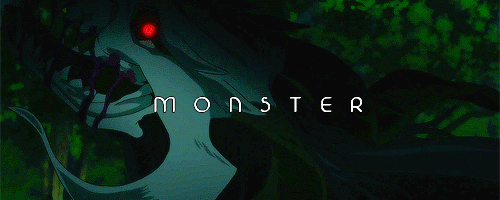

<!--  -->
<!--  -->

# Hi There! I'm Rizqi

- 🧑‍🎓 currently studying at **STT Mandala**
- 🌱 learning **Web Development** and mastering **SQLQueries**
<!--
**abiiki/abiiki** is a ✨ _special_ ✨ repository because its `README.md` (this file) appears on your GitHub profile.

Here are some ideas to get you started:
🧑‍🎓 currently studying at **STT Mandala**

- 🔭 I’m currently working on ...
- 🌱 I’m currently learning ...
- 👯 I’m looking to collaborate on ...
- 🤔 I’m looking for help with ...
- 💬 Ask me about ...
- 📫 How to reach me: ...
- 😄 Pronouns: ...
- ⚡ Fun fact: ...
  -->

### 🌐 Socials:

### 💻 Tech Stack:

     

## 📊 GitHub Stats:

 

---

<!-- Proudly created with GPRM ( https://gprm.itsvg.in ) -->
